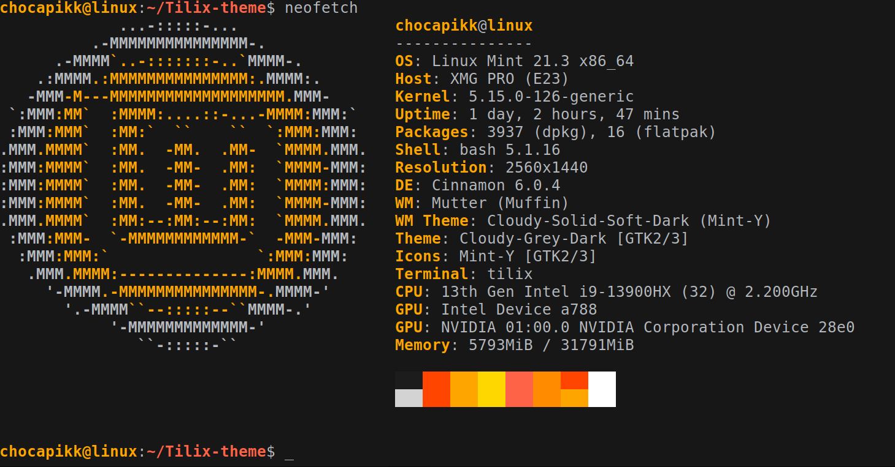

# Tilix Theme: Luxe-Orange

## Preview



A minimalistic and luxurious custom theme for the Tilix terminal emulator, featuring a sleek black background with warm orange and gold accents.

## Installation

1. **Clone or download this repository**:
   ```bash
   git clone https://github.com/Chocapikk/tilix-theme.git
   ```

2. **Copy the theme file**:
   Move the theme JSON file into the Tilix themes directory:
   ```bash
   mkdir -p ~/.config/tilix/schemes
   cp tilix/luxe-orange.json ~/.config/tilix/schemes/
   ```

3. **Restart Tilix**:
   Close and reopen Tilix to reload the themes.

4. **Apply the theme**:
   - Go to **Preferences > Profiles > Color** in Tilix.
   - Select the profile where you want to apply the theme.
   - Under the **Color scheme** dropdown, select `Luxe-Orange`.

## Features

- **Background**: Deep black for an elegant appearance.
- **Text**: White for clear readability.
- **Highlight**: Orange and gold tones for a luxurious look.
- **Palette**: Warm tones with complementary accents.

